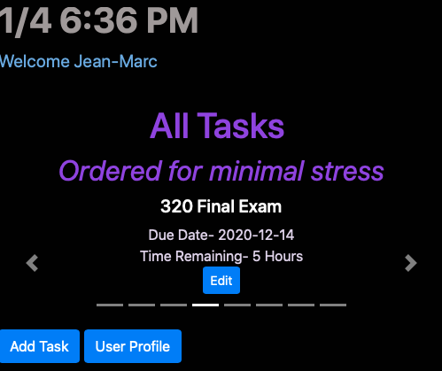
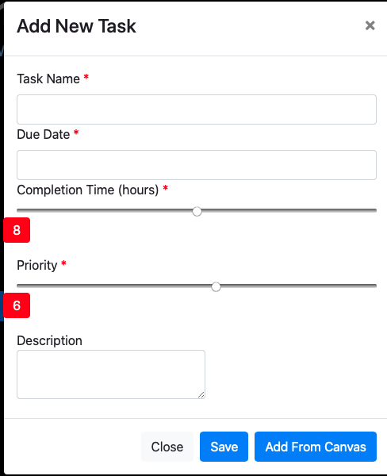
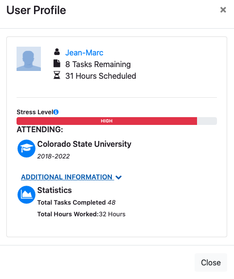

# Task Manager

A simple Task manager website that uses a modified SJF algorithm to schedule tasks. Tasks assigned to a user are automatically ranked in the order they should be completed to minimize stress. As new tasks are added and past tasks have worked logged the task pool gets re-organized.

- Front end made with Javascript/HTML/CSS
- Backend uses PHP and Mysql
- Communication between front and back occurs asynchronously with a RESTful API

# New Features!

- User profile- maps current stress level and logs past statistics
- Link to Canvas account- using a canvas api key all your canvas tasks can automcatically get added to the task manager.

You can also:
- Add tasks manually
- Edit tasks as you do work
- Use site on mobile

# Moving forward
The site currently requires users to register and login, however that is unnecessary and just implemented to show functionality. Users should be able to register with only a username and share data between mobile and computer using their unique API key.
Map stress into the future so users can pinpoint stressful weeks and take proactive measures to lower stress for that week.
Nicer interface to view tasks and log statistics

# Demo

Run the site yourself:
- Download the files in the repo (dont forget the .htaccess file in the /api folder)
- Alter the config file to match your local database
- Load in the necessary sql files found in the task_users.sql file in /demo